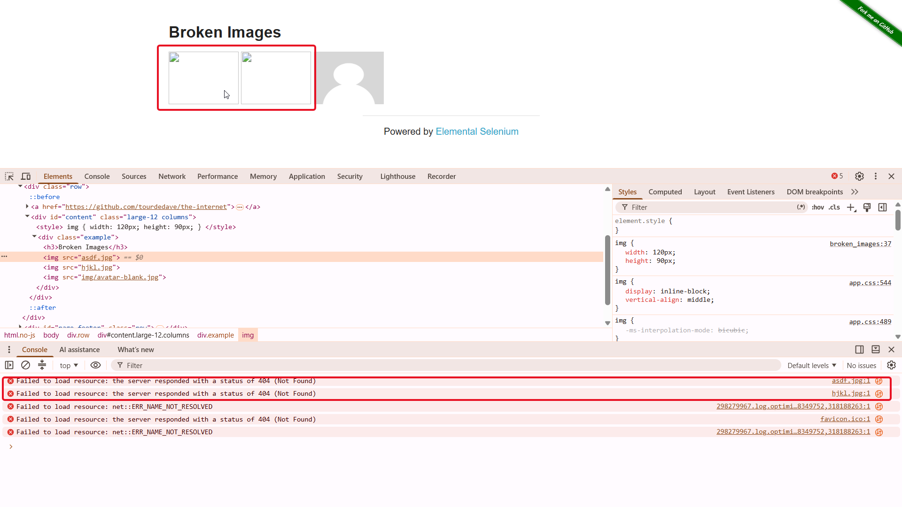

## BRO1 – Two images are broken on the Broken Images page
### Precondition:
- The Broken Images page https://the-internet.herokuapp.com/broken_images is opened
### Steps to reproduce:
1. Locate the first image on the page.
2. Verify that the first image is displayed correctly.
3. Repeat Steps 1-2 for the second image.
4. Repeat Steps 1-2 for the third image.
### Expected result:
- The first image is displayed correctly.
- The second image is displayed correctly.
- The third image is displayed correctly.
- No broken image indicator or missing image placeholder is displayed.
### Actual Result:
- The first image is not loaded and a broken image indicator is displayed.
- The second image is not loaded and a broken image indicator is displayed.
- The requests for asdf.jpg and hjkl.jpg return HTTP 404 (Not Found).
- The third image is displayed correctly.
### Severity: 
Medium
### Priority: 
Medium
### Environment: 
- OS: Windows 11
- Browser: Chrome Version 152.0.7977.83
### Test Case: 
TC37 – Verify image loading
### Attachment:

