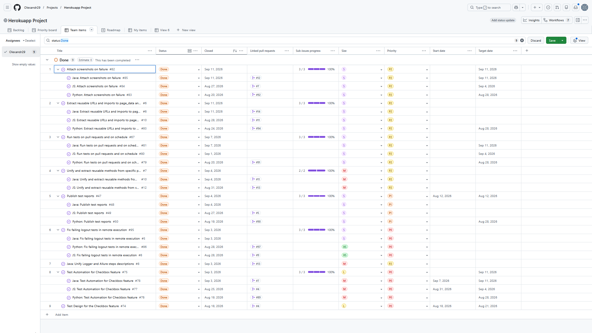

# Sprint 2 Report

## Sprint Goal
The goal of Sprint 2 is to verify the new Checkbox feature and scale the framework.

## Planned Work:
#### 1) Implement not completed work(technical debt) from Sprint 1:
- Issue #47 [Publish test reports](https://github.com/Olexandr29/automation-the-internet-python/issues/47):
	- Issue #48 Java: Publish test reports
	- Issue #49 JS: Publish test reports
	- Issue #50 Python: Publish test reports
- Issue #67 [Run tests on pull requests and on schedule](https://github.com/Olexandr29/automation-the-internet-python/issues/67)

The Issue #67 was divided into separate issues for each language:
- Issue #79 Python: Run tests on pull requests and on schedule
- Issue #80 JS: Run tests on pull requests and on schedule
- Issue #81 Java: Run tests on pull requests and on schedule

- Issue #87 [Create Report for Sprint 1](https://github.com/Olexandr29/automation-the-internet-python/issues/87) also was added. 
The report was created, but the issue has not been closed yet.

#### 2) Implement tasks for the current Sprint 2:

- Issue #74 [Test Design for the Checkbox feature](https://github.com/Olexandr29/automation-the-internet-python/issues/74)
- Issue #75 [Test Automation for Checkbox feature](https://github.com/Olexandr29/automation-the-internet-python/issues/75):
	- Issue #76 Python: Test Automation for Checkbox feature
	- Issue #77 JS: Test Automation for Checkbox feature
	- Issue #78 Java: Test Automation for Checkbox feature
- Issue #82 [Attach screenshots on failure](https://github.com/Olexandr29/automation-the-internet-python/issues/82):
	- Issue #83 Python: Attach screenshots on failure
	- Issue #84 JS: Attach screenshots on failure
	- Issue #85 Java: Attach screenshots on failure
- Issue #95 [Fix failing logout tests in remote execution](https://github.com/Olexandr29/automation-the-internet-python/issues/95):
	- Issue #96 Python: Fix failing logout tests in remote execution
	- Issue #8 JS: Fix failing logout tests in remote execution
	- Issue #5 Java: Fix failing logout tests in remote execution
- Issue #6 [Extract reusable URLs and imports to page_data and base_test](https://github.com/Olexandr29/automation-the-internet-on-python-java-js/issues/6):
	- Issue #93 Python: Extract reusable URLs and imports to page_data and base_test
	- Issue #10 JS: Extract reusable URLs and imports to page_data and base_test
	- Issue #6 Java: Extract reusable URLs and imports to page_data and base_test
- Issue #7 [Unify and extract reusable methods from specific pages to BasePage](https://github.com/Olexandr29/automation-the-internet-on-python-java-js/issues/7):
	- Issue #12 JS: Unify and extract reusable methods from specific pages to BasePage
	- Issue #10 Java: Unify and extract reusable methods from specific pages to BasePage
- Issue #8 [Java: Unify Logger and Allure steps descriptions](https://github.com/Olexandr29/automation-the-internet-java/issues/8)
- Issue #88 [Create Report for Sprint 2](https://github.com/Olexandr29/automation-the-internet-python/issues/88)

**Total: 31 Issues**

## Completed work

**Completed: 30 / 31 Issues**
**Completion: 96,8%**

### Completed:
- Issue #47 [Publish test reports](https://github.com/Olexandr29/automation-the-internet-python/issues/47):
	- Issue #48 Java: Publish test reports
	- Issue #49 JS: Publish test reports 
	- Issue #50 Python: Publish test reports
- Issue #67 [Run tests on pull requests and on schedule](https://github.com/Olexandr29/automation-the-internet-python/issues/67):
	- Issue #79 Python: Run tests on pull requests and on schedule
    - Issue #80 JS: Run tests on pull requests and on schedule
	- Issue #81 Java: Run tests on pull requests and on schedule
- Issue #87 [Create Report for Sprint 1](https://github.com/Olexandr29/automation-the-internet-python/issues/87) 
- Issue #74 [Test Design for the Checkbox feature](https://github.com/Olexandr29/automation-the-internet-python/issues/74)
- Issue #75 [Test Automation for Checkbox feature](https://github.com/Olexandr29/automation-the-internet-python/issues/75):
	- Issue #76 Python: Test Automation for Checkbox feature
 	- Issue #77 JS: Test Automation for Checkbox feature
	- Issue #78 Java: Test Automation for Checkbox feature
- Issue #82 [Attach screenshots on failure](https://github.com/Olexandr29/automation-the-internet-python/issues/82):
	- Issue #83 Python: Attach screenshots on failure
	- Issue #84 JS: Attach screenshots on failure
- Issue #85 Java: Attach screenshots on failure
- Issue #88 [Create Report for Sprint 2](https://github.com/Olexandr29/automation-the-internet-python/issues/88)
- Issue #95 [Fix failing logout tests in remote execution](https://github.com/Olexandr29/automation-the-internet-python/issues/95):
	- Issue #96 Python: Fix failing logout tests in remote execution
	- Issue #8 JS: Fix failing logout tests in remote execution
	- Issue #5 Java: Fix failing logout tests in remote execution
- Issue #6 [Extract reusable URLs and imports to page_data and base_test](https://github.com/Olexandr29/automation-the-internet-on-python-java-js/issues/6):
	- Issue #93 Python: Extract reusable URLs and imports to page_data and base_test
	- Issue #10 JS: Extract reusable URLs and imports to page_data and base_test
- Issue #6 Java: Extract reusable URLs and imports to page_data and base_test
- Issue #7 [Unify and extract reusable methods from specific pages to BasePage](https://github.com/Olexandr29/automation-the-internet-on-python-java-js/issues/7):
	- Issue #12 JS: Unify and extract reusable methods from specific pages to BasePage
	- Issue #10 Java: Unify and extract reusable methods from specific pages to BasePage
- Issue #8 [Java: Unify Logger and Allure steps descriptions](https://github.com/Olexandr29/automation-the-internet-java/issues/8)

### Not completed:
- Issue #88 [Create Report for Sprint 2](https://github.com/Olexandr29/automation-the-internet-python/issues/88)
(will be completed after closing PR and publih this Report)

## Sprint Review
### GitHub Project Board

### Sprint Progress
30 / 31 Issues сompleted - 96,8%

[View current progress →](#completed-work)

.png)

.png)

.png)

### Pull Requests

- automation-the-internet-on-python-java-js:

2 created, 1 merged

- automation-the-internet-on-js:

7 created, 7 merged

- automation-the-internet-python:

6 created, 6 merged

- automation-the-internet-on-java:

3 created, 3 merged

---
18 PRs created

17 PRs merged

### Test Automation
5 x 3 = 15 automated tests implemented

### Test Execution
35 x 3 = 105 tests

105 Passed

3 Tests intentionally Failed, to verify the screenshot attachment functionality, see the pictures below.
After verifying the feature the tests were fixed!

### Allure Report
<table>
  <tr>
    <td width="50%">
      
    </td>
    <td width="50%">
      
    </td>
  </tr>
  <tr>
    <td colspan="2">
      
    </td>
  </tr>
</table>

## Sprint Retrospective

### What Went Well
- Completed all tasks.
- The revert was used to roll back to stable previous commit.
- The ammend was used for rename a commit.
- No bugs were found during testig. To verify the "Attach screenshots on failure" functionality, one of the tests was intentionally made to fail, a screenshot was made during test  failed, and succesfully attached to the results.
- The problem (- The script inside a PR "Related to issue #number" closed the GitHub Project Card instead of mark that the card just related to the specific issue.
This is a problem for issues that cannot be completed with a single PR and require multiple PRs to finish the work.) was uncovered and solved!
- Started working on Sprint report since first week, created PR for the issue "Create Report for Sprint" and planed to make commits every weeks, and close the PR in the end of the sprint
- Sprint planning and task estimates were more realistic and were based on the experience from the previous Sprint.
- For complicated situation used two-lines commit messages
- There is a time to search and create plan for Docker implementation on last week

### What Didn't Go Well
- The script inside a PR "Related to issue #number" closed the GitHub Project Card instead of mark that the card just related to the specific issue.
This is a problem for issues that cannot be completed with a single PR and require multiple PRs to finish the work.
- There was a situation when the UAT was unavaliable locally and one commit was pushed without test verifying - the result was bad.
- Two issues were automatically moved to Done after their linked Pull Requests were closed, although the work was not completed. After moving the issue back to In Progress, GitHub Project Insights continued to count them as completed, resulting in two extra completed issues.
- The scheduled workflow run started later(for different repo) than the configured time. 

### Improvement Actions
- Allocate additional time for "Defect Reporting" during the "Test Design for the {specific} feature" task, if defects are found.
- Discovered how to select necessary repo for the issue when you work on GitHub Project.
- Discovered how turn off the automaticaly close an issue when the issue is not done.
- Took into account that on GitHub free plan a scheduled workflow run started later than the configured time. And discovered the reason, it's because GitHub Actions scheduled workflows are not guaranteed to start exactly at the specified time and may be delayed due to GitHub Actions load or runner availability.

## Next Sprint

- Implement a new feature.
- Continue scaling the framework, including more options for CI/CD and Allure reporting.