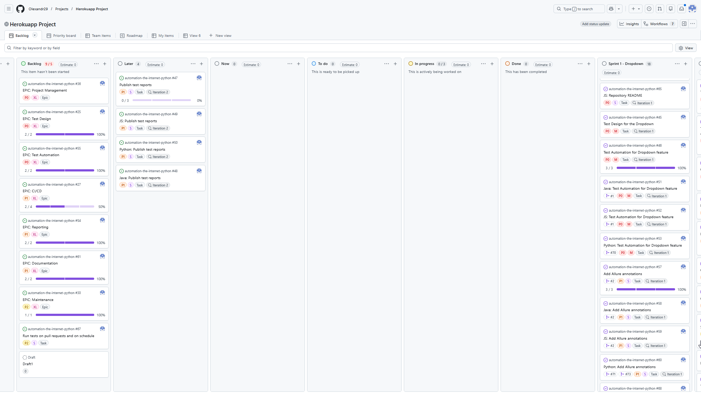
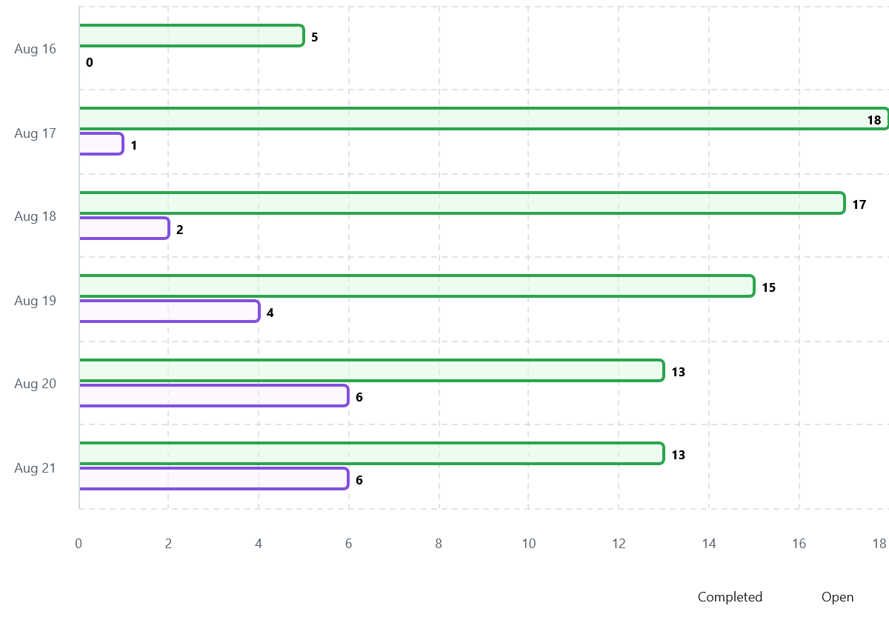
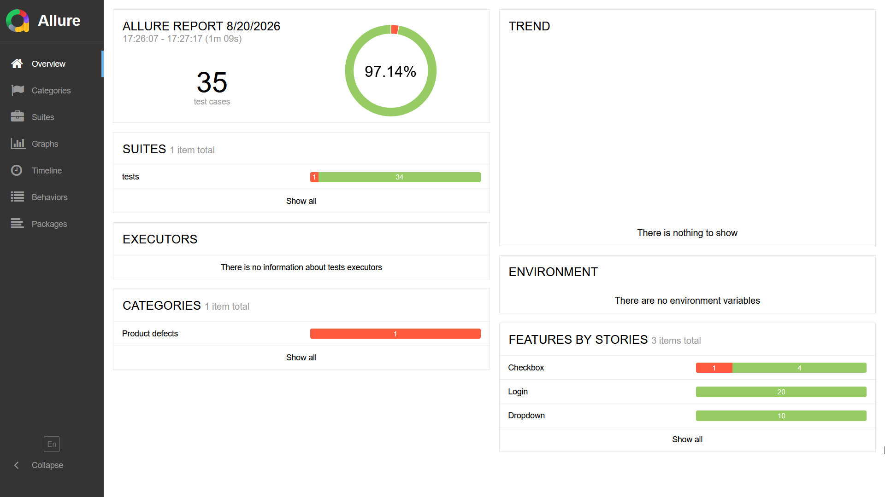
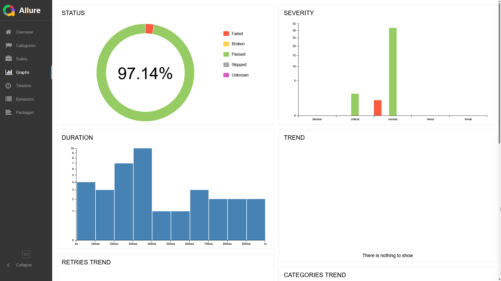
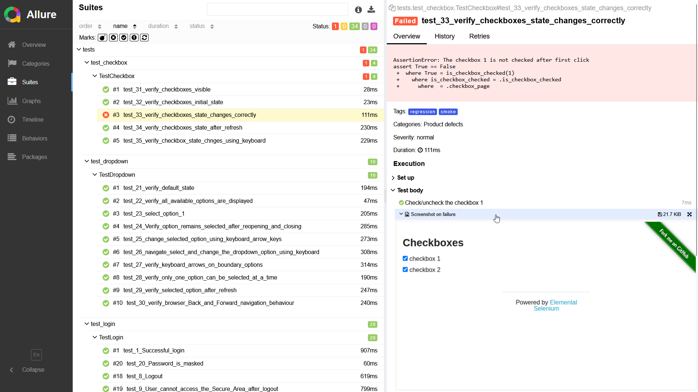

# Sprint 2 Report

## Sprint Goal
The goal of Sprint 2 is to verify the new Checkbox feature and scale the framework.

## Planned Work:
#### 1) Implement not completed work(technical debt) from Sprint 1:
- Issue #47 [Publish test reports](https://github.com/Olexandr29/automation-the-internet-python/issues/47):
	- Issue #48 Java: Publish test reports
	- Issue #49 JS: Publish test reports
	- Issue #50 Python: Publish test reports
- Issue #67 [Run tests on pull requests and on schedule](https://github.com/Olexandr29/automation-the-internet-python/issues/67)

The Issue #67 was divided into separate issues for each language:
- Issue #79 Python: Run tests on pull requests and on schedule
- Issue #80 JS: Run tests on pull requests and on schedule
- Issue #81 Java: Run tests on pull requests and on schedule

- Issue #87 [Create Report for Sprint 1](https://github.com/Olexandr29/automation-the-internet-python/issues/87) also was added. 
The report was created, but the issue has not been closed yet.

#### 2) Implement tasks for the current Sprint 2:

- Issue #74 [Test Design for the Checkbox feature](https://github.com/Olexandr29/automation-the-internet-python/issues/74)
- Issue #75 [Test Automation for Checkbox feature](https://github.com/Olexandr29/automation-the-internet-python/issues/75):
	- Issue #76 Python: Test Automation for Checkbox feature
	- Issue #77 JS: Test Automation for Checkbox feature
	- Issue #78 Java: Test Automation for Checkbox feature
- Issue #82 [Attach screenshots on failure](https://github.com/Olexandr29/automation-the-internet-python/issues/82):
	- Issue #83 Python: Attach screenshots on failure
	- Issue #84 JS: Attach screenshots on failure
	- Issue #85 Java: Attach screenshots on failure
- Issue #88 [Create Report for Sprint 2](https://github.com/Olexandr29/automation-the-internet-python/issues/88)

**Total: 18 Issues**

## Completed work

**Completed: 6 / 18 Issues**

**Completion: 33,3%**

### Completed:
<!-- - Issue #47 [Publish test reports](https://github.com/Olexandr29/automation-the-internet-python/issues/47): -->
<!-- - Issue #48 Java: Publish test reports
	- Issue #49 JS: Publish test reports -->
	- Issue #50 Python: Publish test reports
<!-- - Issue #67 [Run tests on pull requests and on schedule](https://github.com/Olexandr29/automation-the-internet-python/issues/67): -->
	- Issue #79 Python: Run tests on pull requests and on schedule
<!-- - Issue #80 JS: Run tests on pull requests and on schedule
	- Issue #81 Java: Run tests on pull requests and on schedule -->
- Issue #87 [Create Report for Sprint 1](https://github.com/Olexandr29/automation-the-internet-python/issues/87) 

- Issue #74 [Test Design for the Checkbox feature](https://github.com/Olexandr29/automation-the-internet-python/issues/74)
<!-- - Issue #75 [Test Automation for Checkbox feature](https://github.com/Olexandr29/automation-the-internet-python/issues/75): -->
	- Issue #76 Python: Test Automation for Checkbox feature
<!-- - Issue #77 JS: Test Automation for Checkbox feature
	- Issue #78 Java: Test Automation for Checkbox feature -->
<!-- - Issue #82 [Attach screenshots on failure](https://github.com/Olexandr29/automation-the-internet-python/issues/82): -->
	- Issue #83 Python: Attach screenshots on failure
<!-- - Issue #84 JS: Attach screenshots on failure
	- Issue #85 Java: Attach screenshots on failure
- Issue #88 [Create Report for Sprint 2](https://github.com/Olexandr29/automation-the-internet-python/issues/88) -->

### Not completed:

## Sprint Review
### GitHub Project Board
<!--  -->

### Sprint Progress
6 / 18 Issues completed – 33,3%

### Pull Requests

- automation-the-internet-on-python-java-js:

1 created, 1 merged:

"Test Design for the Checkbox feature - #4"

- automation-the-internet-python:

4 created, 4 merged:

"Python: Attach screenshots on failure - #92"

"Python: Run tests on pull requests and on schedule - #91"

"Python: Publish test reports - #90"

"Python: Test Automation for Checkbox feature - #89"

---
5 PRs created

5 PRs merged

### Test Automation
5 x 3 = 15 automated tests implemented

### Test Execution
35 x 3 = 105 tests

102 Passed

3 Failed intentionally, to verify the screenshot attachment functionality 

### Allure Report
<table>
  <tr>
    <td width="50%">
      
    </td>
    <td width="50%">
      
    </td>
  </tr>
  <tr>
    <td colspan="2">
      
    </td>
  </tr>
</table>

## Sprint Retrospective

### What Went Well
- There was no blockers and the plan for the week was overdone
- No bugs were found during testig. To verify the "Attach screenshots on failure" functionality, one of the tests was intentionally made to fail, a screenshot was made during test  failed, and succesfully attached to the results.
- Started working on Sprint report since first week, created PR for the issue "Create Report for Sprint" and planed to make commits every weeks, and close the PR in the end of the sprint
- Sprint planning and task estimates were more realistic and were based on the experience from the previous Sprint.
- For complicated situation used two-lines commit messages

### What Didn't Go Well
- The script inside a PR "Related to issue #number" closed the GitHub Project Card instead of mark that the card just related to the specific issue.
This is a problem for issues that cannot be completed with a single PR and require multiple PRs to finish the work.

### Improvement Actions
- Allocate additional time for "Defect Reporting" during the "Test Design for the {specific} feature" task, if defects are found.

## Next Sprint

- Implement a new feature.
- Continue scaling the framework, including more options for CI/CD and Allure reporting.